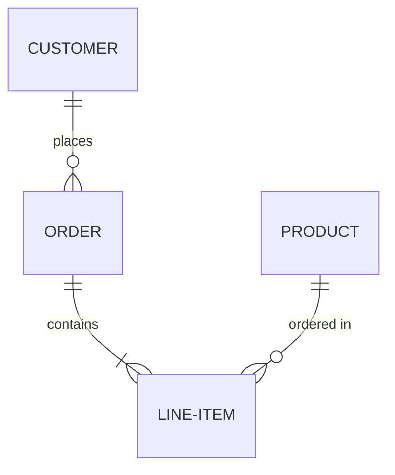

# Diagrams

This directory contains all visual representations of the database system.

## 📊 Structure

### `/erd` - Entity-Relationship Diagrams
- Contains ER diagrams showing entities, attributes, and relationships
- File formats: `.png`, `.jpg`, `.pdf`, `.drawio`, `.mermaid`
- Tools: Draw.io, Lucidchart, MySQL Workbench, dbdiagram.io

### `/schema` - Schema Diagrams
- Detailed database schema with tables, columns, and constraints
- Shows primary keys, foreign keys, and indexes
- Includes normalization documentation

## 🎨 Diagram Standards

- Use clear, readable fonts and colors
- Label all entities, relationships, and cardinalities
- Include legends where appropriate
- Save in both editable and image formats
- Use consistent naming conventions

## 🛠️ Recommended Tools

- **Draw.io/diagrams.net**: Free, web-based diagramming tool
- **dbdiagram.io**: Database diagram tool with code generation
- **MySQL Workbench**: Built-in ER diagram designer
- **Lucidchart**: Professional diagramming tool
- **Mermaid**: Text-based diagram generation

## 📝 Examples

